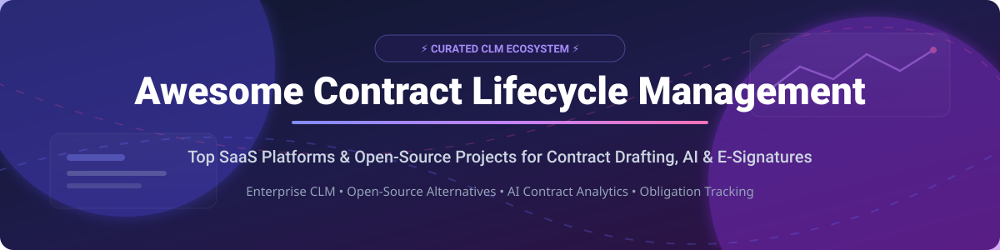

# Awesome Contract Lifecycle Management (CLM) 📑 LegalTech & Open-Source Ecosystem 🚀

  
  
  
  
  
  

---

## 📌 Overview

A curated list of top **Contract Lifecycle Management (CLM)** SaaS platforms and self-hostable **open-source GitHub projects**. Essential tools for legal operations, procurement teams, sales ops, and legal tech developers to automate contract drafting, AI redlining, electronic signatures, repository management, obligation tracking, and compliance.

---

## 💡 Market Insights & Industry Overview

> 📊 **Estimated Market Size & Industry Concentration**: The global Contract Lifecycle Management (CLM) market size is estimated at **$3.8 Billion to $4.2 Billion (2025–2026)** and is projected to exceed **$12 Billion by 2032** growing at a CAGR of ~13.5%. The sector is **moderately fragmented**, featuring dominant enterprise giants (Icertis, DocuSign CLM, Ironclad) alongside high-growth mid-market SaaS vendors and a rapidly emerging open-source document analysis ecosystem.

---

## 💼 SaaS & Hosted CLM Platforms

| Product 🏢 | Description 📜 | Valuation / Revenue Size 💰 | Starting Pricing 🏷️ | Free Tier / Trial Limit ⏳ |
| :--- | :--- | :--- | :--- | :--- |
| **[DocuSign CLM](https://www.docusign.com/products/clm)** | Enterprise contract lifecycle management integrated with DocuSign eSignature, featuring clause libraries, workflow automation, and reporting. | **~$11 Billion** Market Cap (Public: DOCU) | ~$3,000 / month ($36,000/yr starting tier) | No free trial for CLM module (30-day trial available only for basic eSignature) |
| **[Icertis](https://www.icertis.com/)** | Enterprise contract intelligence platform providing obligation management and AI-powered contract analytics for enterprise organizations. | **~$5.0 Billion** Valuation ($350M ARR) | ~$4,000 / month ($48,000/yr enterprise starting quote) | No free tier or trial (Demo request required) |
| **[Ironclad](https://ironcladapp.com/)** | Leading CLM platform for legal teams with workflow automation, redlining, e-signature, and AI legal assistant (Jurist). | **~$3.2 Billion** Valuation ($200M+ ARR) | ~$1,250 / month ($15,000/yr starting tier for mid-market) | No free tier or trial (Demo request required) |
| **[Conga CLM](https://conga.com/)** | CLM within the Conga revenue lifecycle platform, integrated with Salesforce for end-to-end contract generation & signature. | **~$1.5 Billion** Valuation (Thoma Bravo acquired) | ~$35 / user / month (Minimum user threshold applies) | No free tier (Custom demo sandbox upon request) |
| **[Agiloft](https://www.agiloft.com/)** | Flexible no-code CLM platform providing contract creation, custom approval workflows, repository, and obligation management. | **~$600 Million** Valuation (~$100M ARR) | ~$65 / user / month (Billed annually) | Free trial available on request (Standard 14-day sandbox trial) |
| **[Sirion](https://www.sirion.ai/)** | AI-powered CLM platform providing contract authoring, negotiation, repository management, and obligation tracking. | **~$500 Million** Valuation (~$50M ARR) | ~$2,000 / month ($24,000/yr enterprise entry quote) | No free tier or public trial (Demo request required) |
| **[LinkSquares](https://linksquares.com/)** | AI-powered contract analytics and repository management with strong natural language processing and drafting workflows. | **~$800 Million** Valuation (~$40M ARR) | ~$1,000 / month ($12,000/yr entry package) | No free tier or trial (Demo request required) |
| **[ContractPodAi](https://contractpodai.com/)** | AI-driven CLM platform featuring Leah, an interactive legal AI assistant for contract drafting, review, and analytics. | **~$350 Million** Valuation (~$30M ARR) | ~$1,500 / month ($18,000/yr starting tier) | No free tier or public trial (Demo request required) |
| **[Juro](https://juro.com/)** | Browser-based contract collaboration platform with template automation, redlining, and e-signature in a single unified interface. | **~$150 Million** Valuation (~$15M ARR) | ~$1,500 / month ($18,000/yr starting quote for small teams) | 14-day full feature free trial |
| **[SpotDraft](https://www.spotdraft.com/)** | CLM for high-growth tech companies with contract intake, drafting, negotiation, and AI-powered repository search. | **~$100 Million** Valuation (~$10M ARR) | ~$667 / month ($8,000/yr entry tier) | 14-day interactive free trial |
| **[ContractWorks](https://www.contractworks.com/)** | Simple, affordable contract management software with repository search and renewal alerts (by Onit). | **~$80 Million** Valuation (~$12M ARR) | ~$600 / month (Billed annually, includes unlimited users) | 14-day free trial (No credit card required) |
| **[Outlaw](https://www.outlaw.com/)** | Modern contract drafting, negotiation, and e-signature platform for legal teams (acquired by Filevine). | **~$50 Million** Valuation (Acquired by Filevine) | ~$100 / user / month (Billed annually for Pro plan) | 14-day free trial |

---

## 🔓 Open-Source GitHub Projects

Below is a list of top open-source contract management, e-signature, document management, and contract analysis projects on GitHub, sorted by Stars_Count.

| Project 🛠️ | GitHub_Stars ⭐ | License 📜 | Description 📝 |
| :--- | :--- | :--- | :--- |
| **[Paperless-ngx](https://github.com/paperless-ngx/paperless-ngx)** |  | GPL-3.0 | The most popular open-source document management system with OCR, full-text search, tagging, and automated document retention policies. |
| **[Documenso](https://github.com/documenso/documenso)** |  | AGPL-3.0 | Open-source e-signature platform providing electronic signatures, custom signing templates, audit logs, and developer API. |
| **[Mayan EDMS](https://github.com/mayan-edms/mayan-edms)** |  | Apache-2.0 | Free open-source Electronic Document Management System providing document indexing, metadata tagging, version control, and custom workflow automation. |
| **[Anvil DocGen Framework](https://github.com/useanvil/pdf-template-editor)** |  | MIT | Open-source React component & visual template editor for building fillable PDF contract templates and document generation workflows. |
| **[OpenContracts](https://github.com/JSv4/OpenContracts)** |  | Apache-2.0 | Open-source AI contract analysis platform with PDF/text annotation, semantic vector search, and LLM-powered clause extraction. |
| **[Diligent (Frappe ERPNext)](https://github.com/erpnext/diligent)** |  | GNU GPLv3 | Enterprise open-source contract lifecycle management module built on the Frappe framework and integrated into ERPNext. |
| **[Gavel](https://github.com/gavelcms/gavel)** |  | MIT | Modern full-stack open-source CLM application built with Next.js & TypeScript, featuring multi-tenant support, negotiation, and repository. |
| **[DocuSeal](https://github.com/docusealco/docuseal)** |  | MIT | Open-source document signing and digital contract execution platform with fillable PDF field builder. |
| **[Contractor](https://github.com/contractor/contractor)** |  | MIT | Django-based lightweight contract management system featuring document repository, metadata tracking, and expiration/renewal alerts. |

---

## 🤝 How to Contribute

1. 🍴 Fork the repository.
2. 📝 Add or edit entries in `README.md` using clean Markdown formatting.
3. 🔍 Ensure factual details: include project name, URL, short description, pricing/license, and stars.
4. 🚀 Submit a Pull Request (PR) with a short explanation of your additions!

---

## 💖 Support & Community

If you find this list helpful, please consider supporting the project:

- ⭐ **Star** this repository on GitHub to show your appreciation!
- 🔀 **Fork** and share it with legal tech enthusiasts, procurement teams, and developers.
- 💬 Join our community discussion on [Discord](https://discord.gg/jc4xtF58Ve).
- ☕ **Buy a Coffee / Sponsor**: Support ongoing maintenance via [GitHub Sponsors](https://github.com/sponsors/ishandutta2007).

Thank you for helping make Contract Lifecycle Management open, accessible, and community-driven! ❤️

---

## 📈 Star History

---

## ⚠️ Disclaimer

This repository is a community-curated list and does not constitute formal legal advice or commercial endorsement. Enterprise legal operations should verify data privacy compliance (GDPR, SOC2, HIPAA) before deploying any contract software.
